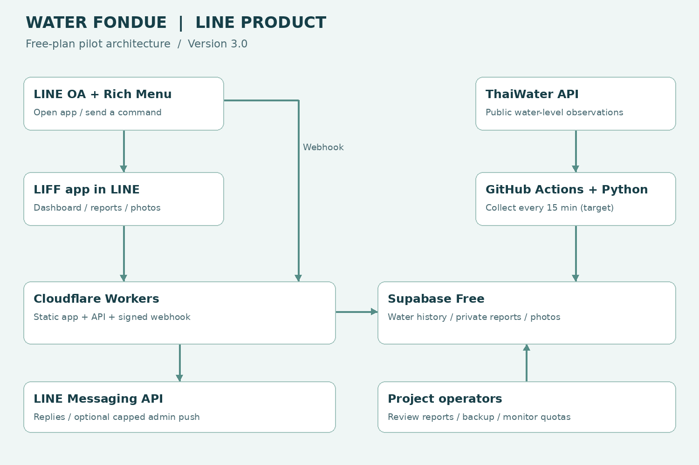

# คู่มือติดตั้ง Water Fondue บน LINE

รุ่น 3.0 • ชุดหลักแทนรุ่น GitHub Pages • ตรวจเงื่อนไขบริการ 2 ตุลาคม 2026

คู่มือนี้พาคุณตั้งระบบระดับน้ำและรับรายงานปัญหาที่เปิดใน LINE ได้ โดยใช้ LINE OA และ LIFF เป็นทางเข้า Cloudflare Workers ให้บริการหน้าแอปกับ API Supabase เก็บข้อมูล และ GitHub Actions เรียก Python ดึง ThaiWater เป้าหมายทุก 15 นาที ไม่ต้องเปิดเครื่องส่วนตัวค้างไว้



สิ่งที่มีในชุดนี้: ตารางระดับน้ำ ค้นหาสถานี ความสดของข้อมูล ฟอร์มแจ้งปัญหาพร้อมรูปและพิกัด รายงานของฉัน หน้าผู้ดูแลเปลี่ยนสถานะ webhook ตอบลิงก์แอป และโมดูล push ทดลองไปผู้ดูแลหนึ่งคนที่ปิดไว้ก่อน

แผนที่คลอง กราฟย้อนหลัง พยากรณ์ฝนและน้ำ และการกระจายแจ้งเตือนอัตโนมัติให้ประชาชนจำนวนมากยังไม่รวมในรุ่นนี้ โครงสร้าง API และฐานข้อมูลรองรับการพัฒนาต่อได้ งานนี้เป็นชุดสำหรับคุณนำไปติดตั้ง ยังไม่ใช่ระบบที่ deploy หรือทดสอบบัญชี LINE จริงของคุณแล้ว

ห้ามใช้คู่มือ GitHub Pages รุ่น 2.1 ปะปนกับรุ่นนี้ แตก ZIP ในโฟลเดอร์ใหม่ หากเคยเปิด workflow เก่าแล้ว ให้ปิด RUN_ENABLED ของ repo เก่าก่อน เพื่อไม่ให้มี collector สองชุดเขียนพร้อมกัน


## 1 ขอบเขตใช้งานฟรีที่เลือก

ใช้ Free plan จริง ไม่ใช้ Trial ไม่ซื้อโดเมน ไม่เปิด billing add-on และไม่อัปเกรดอัตโนมัติ เป้าหมายคือระบบนำร่อง 0 บาทต่อเดือนภายในโควตา โดยเงื่อนไขบริการอาจเปลี่ยนในอนาคต

| บริการ | โควตาหรือเงื่อนไขสำคัญ | วิธีใช้ในชุดนี้ |
|---|---|---|
| Cloudflare Workers Free | 100000 dynamic requests ต่อวัน CPU 10 ms ต่อ request | API เบา รูปย่อในมือถือ ไม่มีงาน ML |
| Supabase Free | DB 500 MB file storage 1 GB egress 5 GB | เก็บระดับน้ำ raw 7 วัน และรูปเล็ก |
| GitHub Actions | standard runner ใน public repository ใช้ฟรี | Python ตามเวลา ไม่ใช้ runner ขนาดพิเศษ |
| LINE OA Free ไทย | ข้อความส่งออกฟรี 300 ต่อเดือน | เน้นเปิด LIFF และ reply ปิด push เริ่มต้น |

ข้อความ reply ไม่ถูกนับรวมโควตาส่งออกแบบ push แต่ยังมี rate limits ของ API หาก broadcast หนึ่งครั้งถึง 100 คน จะใช้ประมาณ 100 ข้อความ ไม่ใช่หนึ่งข้อความ

เพดานที่ตั้งในโค้ด: รายงานไม่เกิน 3 เรื่องต่อบัญชีต่อวัน และ 100 เรื่องรวมต่อเดือนตามเวลาไทย รูปหนึ่งรูปต่อเรื่องไม่เกิน 100 KiB หลังย่อ เพดานรายงานบังคับใน transaction ของ DB เพื่อกันคำขอพร้อมกัน ส่วนรูปตรวจทั้งฝั่ง browser และ API

ตัวอย่างวางแผน ไม่ใช่ผลวัดโหลดจริง: 30 คนต่อวัน × เปิดข้อมูล 5 ครั้ง × 30 วัน = 4500 requests ต่อเดือน หาก JSON น้ำขนาด 20 KB จะประมาณ 90 MB ก่อนประโยชน์จาก cache รูป 100 เรื่อง × 100 KiB ประมาณ 9.8 MiB ต่อเดือน หรือราว 29.3 MiB เมื่อเก็บ 90 วัน

ที่ 18 สถานี และเวลาวัดใหม่ทุก 15 นาที จะเพิ่มได้ถึง 1728 observations ต่อวัน จำนวนจริงขึ้นกับต้นทางและการ upsert ข้อมูลซ้ำ อย่าใช้จำนวนแถวเดาขนาด DB ให้ดู Usage ทุกสัปดาห์

เริ่มนำร่อง 30 ผู้ใช้งานต่อวัน ดู Usage ก่อนขยาย ขีดจำกัด 30 คนนี้เป็นงบประมาณวางแผน ไม่ใช่ตัวบังคับจำนวนผู้ใช้ในโค้ด หากโดนเรียก API จำนวนมาก โควตาอาจหมดและบริการหยุดได้ การแยกสิทธิ์และเพดานรายงานไม่ได้แทนการป้องกัน abuse ทุกชนิด


## 2 เตรียมเครื่องและบัญชี

1. ติดตั้ง Python 3.12 จาก https://www.python.org/downloads/ เลือก Add Python to PATH ถ้ามี
2. ติดตั้ง Node.js รุ่น 22 LTS หรือรุ่นใหม่ที่รองรับ จาก https://nodejs.org/ และ Git จาก https://git-scm.com/downloads/win
3. ติดตั้ง VS Code ที่ https://code.visualstudio.com/ แล้วเปิดโปรแกรมใหม่หลังติดตั้งเครื่องมือ
4. สมัคร GitHub, Cloudflare, Supabase และบัญชี LINE สำหรับดูแล OA เลือก Free ทุกบริการ ไม่ต้องซื้อโดเมน
5. แตก Water_Fondue_LINE_v3_Free.zip จะได้ Water_Fondue เปิดโฟลเดอร์นี้ด้วย VS Code > File > Open Folder
6. เปิด Terminal > New Terminal ใช้ PowerShell ตรวจเครื่องมือ

```powershell
py -3 --version
node --version
npm --version
git --version
```

ถ้า py ไม่มีแต่ python ใช้ได้ ให้ใช้ python แทน py -3 ทุกคำสั่ง โค้ด Python ใช้ standard library ไม่ต้อง pip install ส่วน worker ใช้ npm ci เพื่อติดตั้ง Wrangler รุ่นที่ล็อกไว้

## 3 ทดสอบโค้ดในเครื่องก่อนสร้างระบบจริง

Terminal ต้องอยู่ root ที่มี run.py และโฟลเดอร์ worker รันทีละคำสั่ง

```powershell
py -3 -m unittest discover -s tests -v
node --test worker/tests/*.test.mjs
py -3 run.py collect --profile test --input tests/fixtures/sample.json
py -3 run.py collect --profile local --dry-run
```

ผลคาดหวัง: Python ผ่าน 16 tests; Worker ผ่าน 18 tests; fixture หนึ่งสถานีเขียนลง data/test; dry-run ดึงข้อมูลจริงโดยไม่เขียน DB หรือส่ง LINE จำนวนสถานีจริงอาจต่างจาก 18 ที่เคยทดสอบ

```powershell
cd worker
npm ci
npx wrangler deploy --dry-run
cd ..
```

dry-run ตรวจ build ไม่เผยแพร่จริง ไม่ต้องใส่ secret หรือ login เพื่อ build หาก npm แจ้ง PowerShell script disabled ให้ใช้ npm.cmd และ npx.cmd แทน ไม่จำเป็นต้องลดนโยบายความปลอดภัยทั้งเครื่อง


## 4 สร้าง Supabase และฐานข้อมูล

1. เปิด https://supabase.com/dashboard > New project ในองค์กร Free ตั้งชื่อ water-fondue เลือก region เช่น Singapore ถ้ามี และเก็บ database password ส่วนตัว
2. เมื่อ project พร้อม เปิด SQL Editor > New query คัดลอก sql/supabase.sql ทั้งไฟล์ไปวาง แล้ว Run
3. ตรวจ Table Editor ต้องมี stations, observations, state, reports, line_events และ view latest_water
4. เปิด Storage > New bucket สร้าง water-raw แบบ Private
5. สร้าง bucket อีกอันชื่อ report-photos แบบ Private ตั้ง Allowed MIME types เป็น image/jpeg และขนาดสูงสุด 100 KB หรือ 102400 bytes หากหน้าจอรองรับ
6. เปิด Connect ดู Project URL และ Settings > API Keys สร้าง backend Secret Key ขึ้นต้น sb_secret_ เก็บใน password manager

อย่าใช้ anon หรือ publishable key สำหรับ backend ชุดนี้ และอย่าเปิด public read/write policies ให้ตารางหรือ bucket เว็บเข้าผ่าน Worker ซึ่งตรวจสิทธิ์ก่อนใช้ secret ติดต่อ DB

ใช้ project ใหม่หาก schema เดิมต่างจากชุดนี้ ถ้าเคยรัน SQL v2.1 เดิมตรงกัน ให้ backup ก่อน SQL ชุดนี้คงตารางน้ำเดิมและเพิ่มส่วน reports/line_events แบบสร้างเมื่อยังไม่มี ไม่ใช่เครื่องมือ migrate schema ทุกเวอร์ชัน

ตรวจด้วย SQL Editor

```sql
select count(*) from public.observations;
select count(*) from public.reports;
select has_table_privilege('anon','public.reports','select');
select has_table_privilege('anon','public.reports','insert');
```

สอง count แรกเป็น 0 ได้ก่อนเริ่มเก็บข้อมูล สองสิทธิ์ท้ายต้องเป็น false คอลัมน์ observed_at เก็บ UTC ชนิด timestamptz หน้าแอปแสดงเวลาไทยเอง ไม่แก้ข้อมูลบวก 7 ชั่วโมงอีกครั้ง

ตาราง reports เก็บรหัส LINE ผู้ส่ง รายละเอียด พิกัด ชื่อไฟล์รูป และสถานะ RLS เปิดและปิดสิทธิ์ anon/authenticated ทั้งหมด API เป็นจุดตรวจตัวตนและสิทธิ์ ไม่ใช้การซ่อนปุ่มอย่างเดียว


## 5 นำโค้ดขึ้น GitHub และเปิด collector

1. GitHub > New repository > water-fondue-line > Public ไม่เลือกสร้าง README เพิ่ม เพื่อเริ่ม repo ว่าง
2. กลับ root ใน VS Code ตั้งชื่อและอีเมล Git ของคุณ แล้วรันตามนี้ เปลี่ยน YOUR_USERNAME

```powershell
git config --global user.name "YOUR_NAME"
git config --global user.email "YOUR_EMAIL"
git init
git add .
git status
git commit -m "Water Fondue LINE v3"
git branch -M main
git remote add origin https://github.com/YOUR_USERNAME/water-fondue-line.git
git push -u origin main
```

ก่อน commit ต้องไม่เห็น data/, .dev.vars, .env, node_modules หรือ token จริง โฟลเดอร์ .github ต้องอยู่ root ไม่ซ้อน Water_Fondue อีกชั้น Sign in ผ่านหน้าต่าง Git ที่เปิดขึ้น ไม่ใส่ token ลง URL

3. Repository > Settings > Secrets and variables > Actions สร้าง repository Secrets SUPABASE_URL และ SUPABASE_SECRET_KEY
4. แท็บ Variables สร้าง RUN_ENABLED=false และ SEND_LINE=false
5. Actions > Offline tests ต้องผ่าน จากนั้น Collect water > Run workflow > main
6. ตรวจ step Collect into Supabase สำเร็จ แล้วเปิด Table Editor ให้เห็น observations และ state key last_success
7. เปลี่ยน RUN_ENABLED=true รอดู scheduled run อย่างน้อยสองรอบ

นาที cron คือ 7,22,37,52 ทุกชั่วโมง UTC เป้าหมายทุก 15 นาที GitHub อาจรันล่าช้าหรือข้ามรอบ Public repo ที่ไม่มี activity 60 วันอาจถูกปิด schedule ต้องตรวจ Actions เป็นระยะ ไม่มี SLA เตือนภัย

ไม่ต้องเปิด GitHub Pages รุ่นนี้ไม่ได้ export snapshot ไป Pages อีกแล้ว Worker อ่านค่าล่าสุดจาก Supabase ผ่าน API โดย cache 5 นาที งาน Clean expired raw ลบ raw เกินอายุทุกวัน 17:20 UTC ส่วน observations ไม่ถูกลบอัตโนมัติ


## 6 สร้างหน้าแอปและ API บน Cloudflare

1. เข้า https://dash.cloudflare.com/ สมัครบัญชี Free ไม่ต้องเพิ่มโดเมน เข้า Workers and Pages เพื่อยืนยันว่าใช้ Workers Free
2. เปิด worker/wrangler.jsonc เปลี่ยน name หากจำเป็น ใช้ตัวอักษรอังกฤษเล็กและขีดกลาง เก็บ name นี้คงเดิมในการ deploy ครั้งต่อไป
3. เปิด Terminal ที่ root แล้วรัน

```powershell
cd worker
npm ci
npx wrangler login
npx wrangler deploy
```

Wrangler login เปิด browser ให้ sign in Cloudflare และอนุญาต CLI การ deploy ครั้งแรกใช้ placeholder LIFF ได้เพราะยังปิดรับรายงาน จด URL ที่ได้ เช่น https://water-fondue-line.YOUR_SUBDOMAIN.workers.dev อย่าสร้าง Worker ใหม่ในทุกครั้งที่แก้โค้ด

4. ตั้ง Secret โดยรันทีละคำสั่งแล้ววางค่าที่ prompt ไม่เขียนค่า secret ต่อท้ายคำสั่ง

```powershell
npx wrangler secret put SUPABASE_URL
npx wrangler secret put SUPABASE_SECRET_KEY
```

5. เปิด URL ของ Worker ต่อด้วย /api/health ต้องเห็น ok true และ version 3.0.0
6. เปิด /api/water ต้องเห็น rows และ ingestion จาก Supabase ถ้า collector ยังไม่เคยรัน rows อาจว่าง ถ้าตั้ง secret ไม่ครบจะขึ้น error
7. เปิด URL หลักต้องเห็นสถานีน้ำ เมื่อยังไม่ตั้ง LINE จะแสดงข้อความว่าดูน้ำได้แต่การส่งรายงานยังไม่พร้อม เป็นพฤติกรรมที่ตั้งใจไว้

หน้าเว็บเป็นไฟล์ static และ API เป็น Worker ในโปรเจกต์เดียวกัน ไม่มี server Python ค้างอยู่ที่ Cloudflare การย่อภาพทำในเครื่องผู้ใช้เพื่อลด CPU ของ Worker หาก runtime จริงใช้ CPU เกิน 10 ms จะต้องวัดและลดงาน ไม่อัปเกรดเสียเงินโดยอัตโนมัติ


## 7 สร้าง LINE OA และ Messaging API

1. เข้า https://manager.line.biz/ สร้าง LINE Official Account ชื่อ Water Fondue เลือกแพ็กเกจ Free ของไทย
2. ใน OA Manager เปิด Settings > Messaging API > Enable เลือกหรือสร้าง Provider สำหรับโครงการ เช่น Water Fondue
3. เปิด https://developers.line.biz/console/ เลือก Provider เดียวกัน ต้องเห็น Messaging API channel ของ OA
4. ใน Basic settings ของ Messaging API channel เก็บ Channel secret
5. ใน Messaging API tab ออก Channel access token แบบ long-lived แล้วเก็บไว้
6. กลับ Terminal ใน worker ตั้งสอง Secret นี้

```powershell
npx wrangler secret put LINE_CHANNEL_SECRET
npx wrangler secret put LINE_CHANNEL_ACCESS_TOKEN
```

สองค่านี้มาจาก Messaging API channel ไม่ใช่ LINE Login channel อย่าส่ง token ผ่านแชทหรือ commit ลง GitHub

## 8 สร้าง LINE Login และ LIFF

1. ใน Provider เดียวกับ Messaging API กด Create a new channel > LINE Login เลือก Web app และกรอกข้อมูลตามที่ LINE ขอ
2. ใช้ URL Worker เป็น URL เว็บไซต์ และ /privacy.html เป็น URL คำชี้แจงข้อมูล แต่ต้องแก้ชื่อผู้รับผิดชอบและช่องทางติดต่อก่อนเปิดใช้งานจริง
3. จด Channel ID ของ LINE Login ซึ่งเป็นตัวเลข แยกจาก Channel ID ของ Messaging API
4. เปิดแท็บ LIFF > Add ตั้งชื่อ Water Fondue เลือก Size Full และ Endpoint URL เป็น URL Worker หลักแบบ HTTPS ลงท้าย /
5. เลือก scopes openid และ profile ไม่ขอ email ชุดนี้ไม่บันทึกชื่อหรือรูปโปรไฟล์ แต่ใช้ openid เพื่อให้ server ตรวจ ID token
6. บันทึก จด LIFF ID เช่น 1234567890-abcdefgh และ LIFF URL เช่น https://liff.line.me/1234567890-abcdefgh
7. หากหน้า Basic settings มี Linked LINE Official Account ให้เชื่อม OA ของโครงการ

LIFF ID ไม่ใช่ Channel ID และไม่ใช่ Secret การสร้าง channel ภายใต้ Provider เดียวกันช่วยให้ user ID สอดคล้องกัน อย่าสร้างคนละ Provider โดยไม่ตั้งใจ


## 9 เชื่อม LIFF กับแอปและตั้งผู้ดูแล

1. แก้ worker/wrangler.jsonc ใน vars: LIFF_ID ใส่ LIFF ID และ LINE_LOGIN_CHANNEL_ID ใส่เลข LINE Login Channel ID
2. CONTACT_TEXT ใส่ชื่อและช่องทางติดต่อที่ใช้จริง REPORTS_ENABLED ยังเป็น false
3. แก้ worker/public/privacy.html ระบุผู้รับผิดชอบ ติดต่อ ระยะเวลาเก็บและวิธีขอลบข้อมูลของโครงการจริง ข้อความที่ให้เป็นต้นแบบเพื่อให้ผู้ดูแลเติม ไม่ใช่การรับรองข้อกฎหมาย
4. รัน npx wrangler deploy ในโฟลเดอร์ worker เพื่อใช้ค่าที่แก้
5. เปิด LIFF URL ใน LINE ด้วยบัญชีผู้พัฒนา ยอมรับสิทธิ์ที่แสดง จะเห็นข้อความเข้าสู่ระบบแล้วและรหัสบัญชี U... ของคุณ
6. คัดลอกรหัส U... ของผู้ดูแล ใส่ Secret ADMIN_LINE_USER_IDS ด้วยคำสั่งนี้ หากหลายคนคั่นด้วย comma โดยตรวจเจ้าของบัญชีให้ถูกต้อง

```powershell
npx wrangler secret put ADMIN_LINE_USER_IDS
```

7. ปิดแล้วเปิด LIFF ใหม่ ผู้ดูแลต้องเห็นแท็บเจ้าหน้าที่ ผู้ใช้ทั่วไปไม่เห็นและเรียก API ของเจ้าหน้าที่ไม่ได้
8. เมื่อคำชี้แจงข้อมูลพร้อม ให้เปลี่ยน REPORTS_ENABLED เป็น true ใน wrangler.jsonc แล้ว deploy อีกครั้ง
9. ช่วงทดสอบ LINE Login ที่เป็น Developing อาจใช้ได้เฉพาะผู้มี role ใน channel เพิ่มบัญชีทดสอบใน Roles ก่อน เมื่อจะให้ประชาชนใช้ ต้องเปลี่ยน channel เป็น Published และทดสอบบัญชีที่ไม่มี role ตามขั้นตอน LINE

การ publish channel ไม่เท่ากับการ deploy Worker เป็นคนละขั้นตอน การเพิ่ม role หรือรายชื่อ admin ไม่ควรใช้แทนการเผยแพร่ channel ให้ผู้ใช้ทั่วไป

หากเปิดจาก browser ภายนอก จะมีปุ่มเข้าสู่ระบบ LINE การอ่านระดับน้ำไม่ต้อง login แต่ส่งรายงานและดูรายงานส่วนตัวต้อง login API ตรวจ ID token กับ LINE ทุกคำขอที่มีข้อมูลส่วนตัว ไม่เชื่อ user ID ที่ browser ส่งเอง


## 10 เปิด webhook และทำปุ่มเข้าแอป

1. LINE Developers > Messaging API channel > Messaging API > Webhook URL ใส่ https://YOUR_WORKER.workers.dev/webhook/line
2. กด Verify ต้องผ่าน จากนั้นเปิด Use webhook
3. ใน OA Manager ปิดข้อความตอบกลับอัตโนมัติที่ชนกับคำสั่งของ bot หากไม่ต้องการข้อความซ้ำ ส่วน greeting message ตั้งได้ตามโครงการ
4. เพิ่ม OA เป็นเพื่อน พิมพ์คำว่า น้ำ หรือ เมนู หรือ แจ้งปัญหา หรือ ช่วยเหลือ Bot จะตอบลิงก์เปิดแอป
5. ถ้าไม่ตอบ ตรวจ Channel secret, access token และ LIFF ID ต้องเป็นค่าถูก channel และดูตาราง line_events ว่า claimed, sent หรือ failed

Webhook ตรวจ HMAC SHA256 จาก raw body ก่อน parse JSON และใช้ webhookEventId กันการตอบซ้ำ รูปแบบนี้พยายาม reply เพียงครั้งเดียวต่อ event หากส่งล้มเหลวหลัง claim จะไม่ retry อัตโนมัติ ผู้ใช้พิมพ์ใหม่ได้ จึงไม่ใช้ reply นี้เป็นระบบเตือนภัยฉุกเฉิน

ตั้ง Rich Menu โดยไม่เขียนโค้ด

1. OA Manager > Rich menus > Create new เลือก layout หนึ่งช่องแนวนอนที่รองรับรูป 2500 × 843
2. อัปโหลด docs/LINE_Rich_Menu.png ที่ให้มา หรือใช้ภาพของหน่วยงาน
3. ตั้ง action ของช่องเป็น Link ใส่ LIFF URL ของคุณ ตั้ง label เช่น เปิด Water Fondue
4. ตั้งช่วงแสดงผลและเปิดใช้งาน เมนูอาจใช้เวลาปรากฏตาม LINE ให้ปิดเปิดห้องแชทแล้วลองกด
5. แอปมีเมนูย่อยสถานการณ์น้ำ แจ้งปัญหา และรายงานของฉันอยู่ภายในแล้ว

ตรวจด้วย LINE บนมือถือจริง: กดเมนูแล้วแอปต้องเปิดใน LINE หากกลายเป็น browser ภายนอก ให้ตรวจว่าปุ่มใช้ LIFF URL ไม่ใช่ Worker URL โดยตรง


## 11 ทดสอบรายงาน รูป และสิทธิ์

1. บัญชี A เปิด LIFF > แจ้งปัญหา เลือกประเภท เขียนรายละเอียดอย่างน้อย 10 ตัวอักษร
2. กดตำแหน่งปัจจุบันเมื่ออยู่จุดเกิดเหตุจริง หรือกรอกพิกัดเอง ถ้าไม่รู้ให้เว้นว่างทั้งสองช่องและอธิบายสถานที่
3. เลือกรูปหนึ่งรูป Browser ย่อเป็น JPEG และวาดใหม่เพื่อลด metadata ต้องรอข้อความย่อรูปเสร็จก่อนส่ง หากเครื่องอ่าน HEIC ไม่ได้ให้ใช้ JPEG หรือ PNG
4. ยอมรับคำชี้แจงแล้วส่ง ต้องเห็นรหัสรายงาน UUID ตรวจ Table Editor และ report-photos ว่ามีข้อมูล
5. เปิดรายงานของฉัน ต้องเห็นเรื่องของ A และเปิดรูปได้ URL รูปมีอายุประมาณ 60 วินาที ไม่ใช่ public bucket
6. เปิดด้วยบัญชี B ต้องไม่เห็นรายงานของ A หรือเรียก URL API ของ A ได้
7. บัญชีผู้ดูแลเปิดเจ้าหน้าที่ > โหลดงาน เลือกสถานะ กำลังตรวจสอบ แล้วบันทึก บัญชี A โหลดใหม่ต้องเห็นสถานะเปลี่ยน
8. ทดลองส่งเกิน 3 เรื่องในวันเดียวกัน ต้องถูกปฏิเสธด้วยข้อความถึงเพดาน อย่าทดสอบจนใช้โควตาเดือนหมดในระบบนำร่องจริง

ถ้าบันทึกเรื่องสำเร็จแต่รูปส่งไม่สำเร็จ หน้าจอจะบอกและคงรหัสเดิมไว้ กดส่งอีกครั้งเพื่อแนบรูปในเรื่องเดิมได้ การส่งซ้ำ UUID เดิมใช้ record เดิม ไม่สร้างเรื่องซ้ำ เมื่อรีโหลดหน้าแอป UUID ที่ค้างอยู่จะหาย หากไม่แน่ใจให้ดูรายงานของฉันก่อนส่งใหม่

หน้ารายงานแสดง 100 เรื่องล่าสุดต่อการอ่าน ยังไม่มี pagination UI หรือระบบลบผ่านหน้าแอป ผู้ดูแลรับคำขอลบและจัดการใน Supabase ตามขั้นตอนดูแลข้อมูล

รูปตรวจชนิดเบื้องต้นและขนาด ไม่ใช่ antivirus หรือระบบคัดกรองเนื้อหา ข้อมูลที่ผู้ใช้ส่งอาจผิดหรือไม่เหมาะสม เจ้าหน้าที่ต้องตรวจสอบก่อนนำไปดำเนินการหรือเผยแพร่ต่อ


## 12 แจ้งเตือนอัตโนมัติแบบจำกัดโควตา

ค่าเริ่มต้น SEND_LINE=false และ config.json มี line_enabled=false พร้อม rules ว่าง ระบบเก็บน้ำและ LIFF ใช้งานได้โดยไม่เปิด push

หากต้องการทดลองแจ้งผู้ดูแลหนึ่งคน หลังได้เกณฑ์รายสถานีที่ตรวจสอบแล้ว

1. ผู้ดูแลเพิ่ม OA เป็นเพื่อน และใช้ user ID U... จาก Provider เดียวกัน
2. GitHub Actions Secrets เพิ่ม LINE_CHANNEL_ACCESS_TOKEN และ LINE_TARGET_ID
3. ใน config.json ตั้ง line_enabled=true และเพิ่ม rules ของ station_key ที่มีอยู่จริง เช่นรูปแบบด้านล่าง ต้องแทนค่าเกณฑ์ก่อนใช้

```json
"rules": {
  "thaiwater:waterlevel:AGENCY_ID:STATION_ID": {
    "warning_msl": 999
  }
}
```

999 เป็น placeholder ไม่ใช่เกณฑ์เตือนภัย ต้องใช้ระดับ ม.รทก. ของสถานีนั้นที่ผู้รับผิดชอบยืนยัน ห้ามนำค่าต่าง datum มาเทียบกัน

4. คง line_monthly_cap=50 ตัวนี้เทียบกับยอดใช้ OA ที่ LINE รายงานรวม ไม่ใช่การเพิ่มโควตาฟรีอีก 50 ข้อความ
5. ตั้ง SEND_LINE=true แล้ว Run Collect water ด้วยมือหนึ่งครั้ง ดูข้อความและ state ก่อนปล่อย schedule
6. ปิดส่งได้ทันทีด้วย SEND_LINE=false

ส่งเฉพาะการเปลี่ยนสถานะ warning และ recovery จากค่าตรวจวัดที่สด ไม่ได้พยากรณ์น้ำท่วม และไม่มี hysteresis หากค่าสลับใกล้เกณฑ์บ่อยอาจใช้โควตาเร็ว ถึง cap แล้วไม่ส่งต่อ ส่วนเว็บยังดูน้ำได้

โค้ดรองรับหนึ่งผู้ดูแล ไม่รองรับ broadcast ทุกสมาชิก อย่าใช้ OA เดียวส่ง campaign พร้อมทดสอบแจ้งเตือนจนเข้าใจยอดใช้รวม Pending ที่เกิน 23 ชั่วโมงหรือสถานะเปลี่ยนระหว่าง retry ต้องตรวจ OA และ state ก่อนแก้ ไม่ลบ pending แบบเดาสุ่ม


## 13 ดูแลพื้นที่ สำรอง และหยุดระบบ

ทุกสัปดาห์ตรวจ Supabase Usage, Cloudflare Workers metrics, GitHub Actions และโควตา OA ก่อนเพิ่มผู้ใช้ ตั้งเป้าเตือนตัวเองเมื่อ DB ประมาณ 300 MB, storage 600 MB หรือ egress 3 GB ต่อรอบบัญชี ค่าเหล่านี้เป็น buffer ของโครงการ ไม่ใช่โควตาที่ผู้ให้บริการรับรอง

raw_days=7 และ workflow cleanup ดูแล raw ตามอายุ แต่ history, reports และรูปไม่มีการลบอัตโนมัติ ผู้ดูแลต้องกำหนดอายุข้อมูล เช่นรายงานและรูป 90 วันหลังพิจารณาความต้องการพื้นที่ แล้วทำตามคำชี้แจงที่ประกาศจริง

สำรองก่อนลบหรือแก้ schema

1. ปิด RUN_ENABLED และ SEND_LINE ใน GitHub ปิดรับรายงานด้วย REPORTS_ENABLED=false แล้ว deploy ปิด Use webhook ชั่วคราว รอคำขอที่กำลังทำอยู่จบ
2. ที่ Terminal root ตั้ง URL และรับ secret แบบไม่แสดงบนจอ

```powershell
$env:SUPABASE_URL="https://PROJECT_REF.supabase.co"
$secure=Read-Host "Supabase secret" -AsSecureString
$env:SUPABASE_SECRET_KEY=[System.Net.NetworkCredential]::new("",$secure).Password
py -3 run.py backup --profile production --output data/backup/water.jsonl.gz
py -3 tools/backup_private.py --output data/backup/private_20261002
```

3. private backup ต้องได้ COMPLETE.json, private.jsonl.gz และ photos/ ถ้าไม่มี COMPLETE ถือว่าไม่ครบ ห้ามลบต้นฉบับ เก็บสำรองในพื้นที่ส่วนตัวอีกแห่ง ไม่ commit ลง public repo
4. ทดลองกู้ข้อมูลน้ำใน local/test DB ว่างด้วยคำสั่งเดิมด้านล่าง การ restore นี้ไม่กู้ reports, photos หรือ Cloud อัตโนมัติ ส่วน private backup ให้ตรวจจำนวนแถวและเปิดรูปก่อนใช้แผนกู้คืนด้วยผู้ดูแล

```powershell
py -3 run.py restore --profile test --input data/backup/water.jsonl.gz
Remove-Item Env:SUPABASE_SECRET_KEY
Remove-Item Env:SUPABASE_URL
Remove-Variable secure
```

5. เมื่อต้องลบรายงานหมดอายุ ใช้ Table Editor เลือก id และ photo_path ของเรื่องนั้น ตรวจ backup แล้วลบไฟล์ที่ตรงกันใน Storage > report-photos และลบแถว reports อย่าลบ history น้ำเพื่อแก้พื้นที่โดยไม่มีแผน archive
6. ใช้ sql/maintenance.sql ตรวจขนาดและสถานะ webhook คำสั่งลบ line_events เก่าในไฟล์ถูก comment ไว้ให้ตรวจเอง หลังเสร็จเปิด webhook, reports และ RUN_ENABLED กลับตามเดิม

Supabase Free อาจ pause หลังไม่มี activity หนึ่งสัปดาห์ และไม่มี automatic backup รวมในแผน การใช้ฟรีต่อเนื่องจึงต้องมีคนตรวจ ไม่ใช่ติดตั้งแล้วปล่อยโดยไม่มีผู้ดูแล


## 14 แก้ปัญหาและเกณฑ์ส่งมอบ

| อาการ | จุดตรวจ |
|---|---|
| API น้ำ 502 หรือ 503 | Worker secrets URL/key SQL และ collector |
| LIFF ID ไม่ถูกต้อง | ใช้ LIFF ID ไม่ใช่ Login Channel ID |
| ID token ไม่มีหรือ 401 | scope openid และ LINE_LOGIN_CHANNEL_ID |
| บัญชีอื่นเข้าไม่ได้ | LINE Login Published หรือเพิ่ม role ช่วงทดสอบ |
| ไม่เห็นแท็บเจ้าหน้าที่ | ADMIN_LINE_USER_IDS ตรงกับรหัสที่ server ตรวจหรือไม่ |
| Webhook Verify ไม่ผ่าน | path /webhook/line และ Messaging Channel secret |
| รูปส่งไม่ผ่าน | bucket private report-photos ขนาด MIME และสิทธิ์ |
| ถึงเพดานรายงาน | 3 ต่อ user ต่อวัน หรือ 100 รวมต่อเดือน |
| Worker error 1027 | Free daily request quota หมด รอรอบใหม่และตรวจ abuse |
| CPU limit exceeded | ดู metric งาน auth/upload ลดงานก่อน ไม่เปิด Paid อัตโนมัติ |
| GitHub ไม่รันตามเวลา | RUN_ENABLED default branch inactivity หรือ scheduler delay |
| เว็บแสดงข้อมูลเก่า | ดูทั้งเวลาเซนเซอร์และ last_success cache เพิ่มได้ 5 นาที |

เกณฑ์ก่อนให้คนในพื้นที่ใช้

- tests ผ่าน และ Wrangler dry-run build ผ่าน
- collector จริงทำงานอย่างน้อยสอง scheduled runs และ DB มีเวลาตรวจวัดถูกต้อง
- /api/health กับ /api/water ใช้ได้บน URL จริง
- LINE Login Published สำหรับผู้ใช้จริง และ LIFF เปิดจาก Rich Menu ใน LINE ได้
- ส่งรายงานพร้อมรูปจากมือถือจริงหนึ่งเรื่องและติดตามสถานะได้
- บัญชี B อ่านรายงานและรูปของบัญชี A ไม่ได้ ทั้งหน้าแอปและ API
- ผู้ดูแลเปลี่ยนสถานะได้ และผู้ใช้ทั่วไปทำไม่ได้
- Webhook Verify ผ่านและพิมพ์ เมนู ได้ลิงก์ตอบกลับ
- ตรวจ Free plan ทุกบัญชี และมีผู้รับผิดชอบดู Usage กับ backup

ข้อจำกัดการตรวจของชุดส่งมอบ: ทดสอบโค้ดด้วย mocks, SQL บน PostgreSQL แบบ WASM, build และหน้าเว็บจำลองได้ แต่การ login LINE จริง การเขียน Supabase Storage จริง และ CPU/โควตาบน Cloudflare Free ต้องผ่าน checklist บนบัญชีคุณก่อน ไม่ถือว่าเป็นการทดสอบ production แล้ว


## 15 แผนที่ไฟล์และเอกสารอ้างอิง

| ส่วน | ไฟล์สำคัญ |
|---|---|
| Python collector | run.py และ water_fondue/ |
| Config น้ำและ LINE push | config.json |
| งานตามเวลา | .github/workflows/collect.yml และ cleanup.yml |
| หน้าแอป LIFF | worker/public/index.html app.js style.css |
| คำชี้แจงข้อมูล | worker/public/privacy.html |
| API และ webhook | worker/src/index.js |
| ตรวจข้อมูลและลายเซ็น | worker/src/core.js |
| ยืนยัน LINE และอ่าน DB | worker/src/services.js |
| Deployment config | worker/wrangler.jsonc |
| Schema และเพดานรายงาน | sql/supabase.sql |
| สำรองรายงานและรูป | tools/backup_private.py |
| Unit tests | tests/ และ worker/tests/ |

อัปเดตหน้าแอป: แก้โค้ดแล้วทดสอบ จาก worker รัน npx wrangler deploy จากนั้น commit/push เก็บเวอร์ชัน การ push GitHub อย่างเดียวไม่ deploy Worker ในชุดนี้ ส่วน config.json ของ collector ต้อง commit/push จึงมีผลต่อ GitHub Actions

Secret ตั้งผ่าน CLI หรือ Dashboard เท่านั้น .dev.vars.example เป็นแค่ชื่อค่าตัวอย่าง หากทดสอบ local ให้คัดลอกเป็น .dev.vars ซึ่งถูก gitignore แล้ว ไม่ใช้ token จริงใน screenshot หรือแชท

แหล่งอ้างอิง ตรวจวันที่ 2 ตุลาคม 2026

1. Workers quotas: https://developers.cloudflare.com/workers/platform/limits/
2. Static Assets: https://developers.cloudflare.com/workers/static-assets/
3. Supabase Free: https://supabase.com/pricing
4. Supabase keys: https://supabase.com/docs/guides/getting-started/api-keys
5. GitHub billing: https://docs.github.com/en/actions/concepts/billing-and-usage
6. LINE free quota: https://lineforbusiness.com/th/service/line-oa-features/broadcast-message
7. LINE message pricing: https://developers.line.biz/en/docs/messaging-api/pricing/
8. LIFF setup: https://developers.line.biz/en/docs/liff/registering-liff-apps/
9. Verify ID token: https://developers.line.biz/en/reference/line-login/#verify-id-token
10. Verify signature: https://developers.line.biz/en/docs/messaging-api/verify-webhook-signature/

เมนูผู้ให้บริการอาจเปลี่ยน ให้เทียบหน้าจอกับเอกสารทางการเมื่อชื่อเมนูต่างกัน หากบริการเปลี่ยนเงื่อนไขหรือเกินโควตา ให้หยุดส่วนที่กินทรัพยากรก่อนตัดสินใจ ไม่เปิดแผนเสียเงินเพื่อแก้ปัญหาโดยอัตโนมัติ
